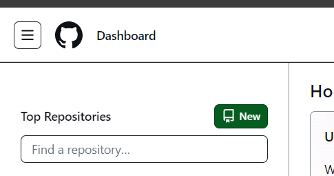
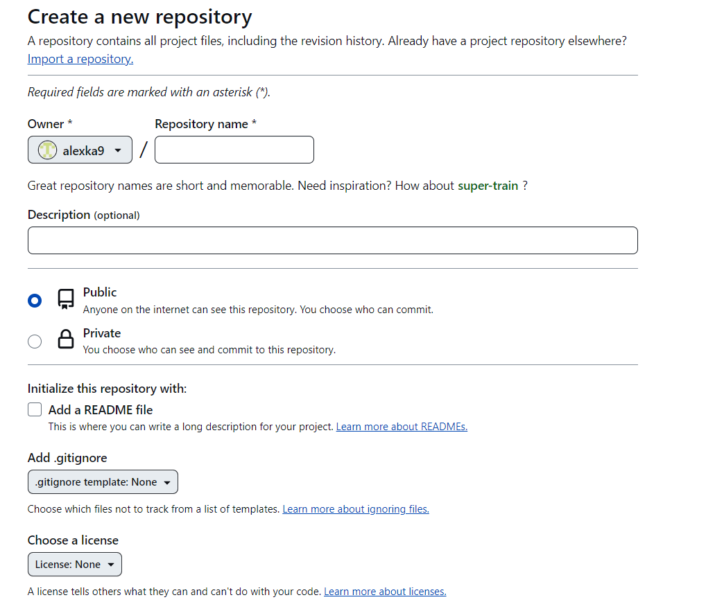
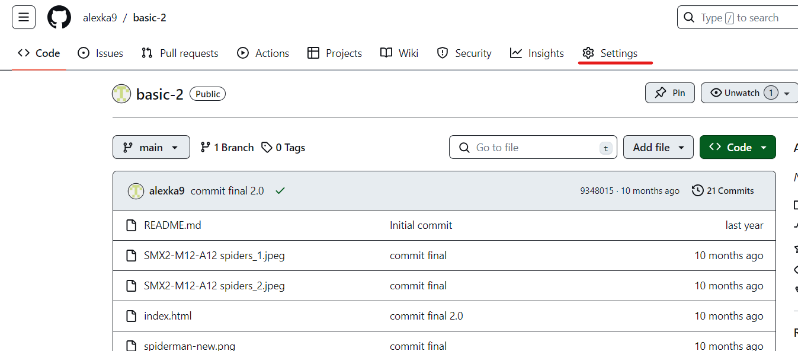
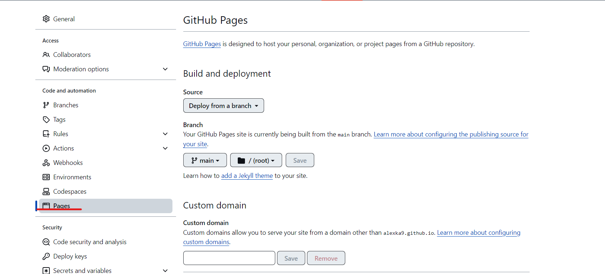
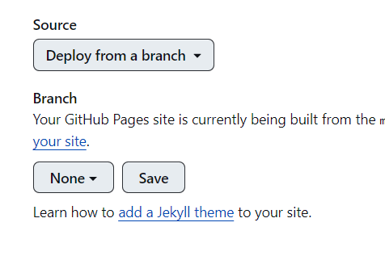
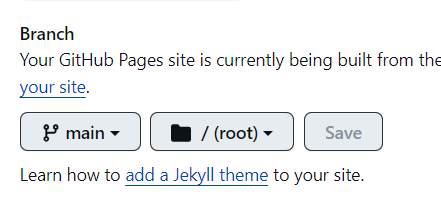
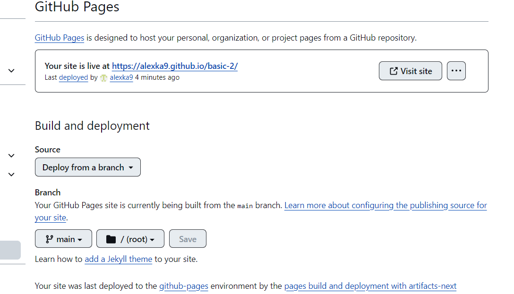
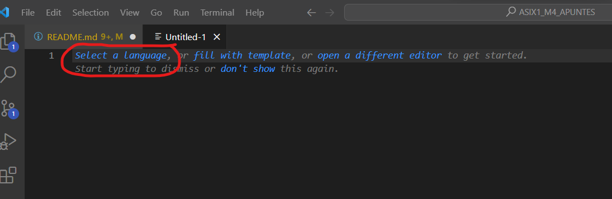
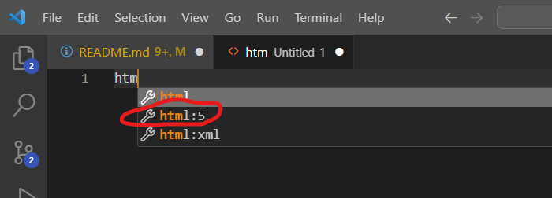
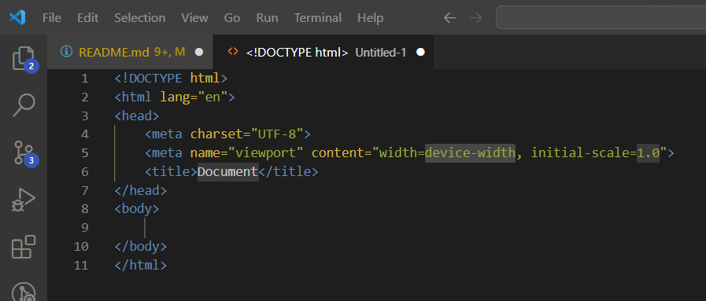

# ASIX1_M4_APUNTES
<h1>Git Hub</h1>
Para crear un repositorio en Git hub es registrarte para poder crearlo una vez te registras en el inicio veras un boton verde que pone new

<br>
Se te dirija a una pestaña para ponerle el nombre y si quieres que tu pagina web sea publica o privada, añadir el archivo de lectura para que se pueda ver tu pagina

<br>
Para publicar tu pagina web tienes que hacer lo siguiente cuando estes en la pagina de incio de tu pagina web es decir seleccionado la pagina que quieres publicar arriba en la barra de tareas veras a opcion de settings

<br>
Cuando ya lo has seleccionado en la barra lateral veras una opcion que pone pages

<br>
Lo siguiente en la parte de brunch tienes que poner el boton none y luego save

<br>
Despues poner que el none a la raiz poner main y save, porque al darle la boton none te sale un desplegable donde para ponerle main

<br>
Entonces nos saldra un mensaje arriba que se esta subiendo la pagina web y dde golpe nos aparecera en la misma pagina arriba en una seccion el link de la pagina web

<br>
<h1>MARKDOWN</h1>
Para poner una palabra en una topologia de cursiva se pone con dos asteriscos dentro de la palabra *ejemplo* o tambien _ejemplo_ poniendo las dos rayas hacia abajo tambien funciona.
Para poner la palabra en negrita son la mimsmas opciones que en la de cursiva pero en este caso cambia poniendo dos asteriscos acada lado **ejemplo** __ejemplo__ y estaran las dos palabras en negrita.

Para hacer un menu de opciones de puede hacer de dos maneras que son poniendo el numero que seria

1. Primera opcion del menu
2. Segunda opcion del menu
3. Tercera opcion del menu

O de esta manera tambien se puede hacer:

* Primera opcion de lista desordenada
* Segunda opcion de lista desordenada
- Tercera opcion de lista desordenada
   1. Primer Submenu
   2. Segundo submenu
- Cuarta opcion de lista desordenada
   * Tercer submenu
   * Cuarto submenu
+ Quinta opcion de lista desordenada
+ Sexta opcion de lista desordenada

<h1>HTML</h1>

La estructura del html que nos vamos a encontrar en nuestra aplicacion que en este caso es la del Visual Studio Code.
Los tres acentos abiertos lo que nos hace, que la estructura que pongamos no se ejecute hace que solo salga por pantalla como si fuera un comentario
```
<html>
   <head>
   </head>
   <body>
      <p> Esto es un texto</p>
    </body>
<html>
```
Para poner un enlace en nuestra pagina web ponemos las siguientes instrucciones
Ponemos los dos corchetes para poner en medio un texto informativo del enlace despues cerramos los corchetes, despues abrimos parentesis y ponemos una URL cualquiera despues ponemos entre comillas de que setrata esa URL que hemos insertado
```
[Esto es un enlace](https://joan23.fje.edu "Enlace a la web del cole")
```
Para crear una tabla ponemos | esta raya y dentro lo que queramos poner dentro de nuestra tabla despues podemos poner |centrada| ara que se centre el texto que esta dentro de la tabla


|Primera Col.|Segunda Col.|3 Col|
|---------------|:------------:|---------:|
|Col 2 es|Centrada|35€|
|Col 3 es|Derecha|134€|
|Estilo Cebra|Gris|Blanco|
|Clase|ASIX1|M4|

Para poner una imagen en nuestra pagina de html tendremos que utilizar el siguiente atributo de img


Lo el br que hace es que termite crear un salto de linea, es un elemento vacio que no tiene nada dentro.
<br>
Y el hr nos hace un intro en el que nos inserta una linea de punta a punta de la pagina web
<hr>

En el html podemos hacer una lista de elementos que es un conjunto de elementos en los que se puede agrupar las etiquitas: 
Se puede hacer con la etiqueta ol que es la para listas ordenadas como en este ejemplo de una lista de videojuegos ordenada con la etiqueta ol y cada elemento dentro tiene la etiqueta de li:
```
<ol>
   <li>The Legend of Zelda: Breath of the Wild</li>
   <li>Super Mario Odyssey</li>
   <li>Animal Crossing: New Horizons</li>
   <li>Splatoon 2</li>
   <li>Super Smash Bros. Ultimate</li>
   <li>Mario Kart 8 Deluxe</li>
   <li>Pokémon Sword and Shield</li>
   <li>Luigi's Mansion 3</li>
   <li>Fire Emblem: Three Houses</li>
   <li>Super Mario Maker 2</li>
</ol>
```
Y con la etiqueta ul hacemos una lista desordenada utilizaremos el mismo ejemplo de los videjuegos:
```
<ul>
  <li>The Legend of Zelda: Breath of the Wild</li>
  <li>Super Mario Odyssey</li>
  <li>Animal Crossing: New Horizons</li>
  <li>Splatoon 2</li>
  <li>Super Smash Bros. Ultimate</li>
  <li>Mario Kart 8 Deluxe</li>
  <li>Pokémon Sword and Shield</li>
  <li>Luigi's Mansion 3</li>
  <li>Fire Emblem: Three Houses</li>
  <li>Super Mario Maker 2</li>
</ul>
```
Para poner links o URL que nos direccionen a otras paginas ponemos la etiqueta a que la estructura de la etiqueta es la siguente:

<a heref="direccion de URL" alt="para poner un texto alternativo en la url">

Para poner comentario en nuestro codigo es poniendo esto: 

```
<!-- Esto es un comentario>
```

<br>
Para cambiar la tipografia de nuestra pagina web tendremos que poner un link en el head de nuestro archivo.html que es poner este link en el head:
```
<script src="https://kit.fontawesome.com/e406714e56.js" crossorigin="anonymous"></script>
```


<h1>Visual Studio Configuracion</h1>

Cuando abrimos el visual studio code veremos una pagina completamiente en blanco y tendremos que ir a la barra de tareas de arriba del visual poner new text file y seleccionamos el tipo de formato que vamos a  utilizar.
En la primera linea nos salra para poner el tipo de lenguaje que tendra nuestra pagina.
Si elegimos html abajo a la derecha nos saldra el formato del lenguaje de la pagina.

Podemos hacer que nos haga una pequeña estructura para html si ponemos html:5, le damos a intro y nos saldra una pequeña estructura.


<br>
Vemos que en la estructura hay el tipo de lenguaje, luego el idioma en el que esta puesta la pagina que en este caso es HTML en la tercera linea tendremos el comando head con su contenido dentro y luego se cierra en la septima linea, depues en la octava linea tenermos el comando body que es donde podremos todo el contenido para crear nuestra pagina web.

<h1>CSS</h1>

Para poner un estilo a una tabla tendremos que crear un archivo.css la creacion es igual para cuando creamos la pagina html ponemos new text file y luego el formato que seria css o tambien podemos poner en la etiqueta del body arriba de nuestra estrcutura una etiqueta de style que dentro de esa estructura es donde pondremos los estilos de la tabla
Ejemplo:
```
<body>
   <style>
      table{
         color: red;
         text-align: center;
         background-color: grey;
      }
   </style>
</body>
```
Lo que puesto es que a la tabla le asigne unos estilos la etiqueta color es que cambiar el color del texto que este dentro de la tabla.
El text-align lo que hace es alinear el texto al centro.
El background-color es que añade un color de fondo a nuestra tabla

Si queremos que por ejemplo hacemos dos tablas y queremos que cada elemento de la tabla tengo un estilo diferente con los atributos de class y id podemos asignarle a cada tabla un unico estilo con esos atributos

Que se usan dentro de las etiquetas como por ejemplo en la etiqueta de table dentro de la etiqueta ponemos el atributo class:
```
<table class="estilo_tabla1">
```

Y con el atributo de id lo mismo:

```
<table id="estilo_tabla2">
```
Entoces en el style y en archivo externo de CSS tendremos que poner un . delante del nombre que le hemos asignado con el atributo class es decir asi:

```
.estilo_tabla1{
   padding: 5%;
   text-align: right;
   color: white
}
```
<br>
Y con el id se pone un # delante del nombre que le hemos puesto al id es decir asi:

```
#estilo_tabla2{
   background-color: blue;
   color: pink;
}
```
<br>
Cuando queremos poner por ejemplo que el formato del tipo de letra, color de fondo... afecte a toda la pagina del html ponemos un * y despues los corchetes Ejemplo:
<br>

```
*{
   background-color: grey;
}
```

<br>
Si queremos que la pagina tenga responsive, es que cuando tu pagina web se ponga en un dispositivo cualquiere se adapte al tamaño de pantalla de ese dispositivo Ejemplo:

```
@media only screen and (max-width: 700px){
    .column-3{
        width: 100%;
    }

    .column-4{
        width: 50%;
    }
}
```

<br>
Lo que significa es que cuando la pantalla supere los 700px se aplicaran los cambios que pongamos abajo para que se vea adaptable a la dimension de nuestra pagina web cuando lo veamos en un dispositivo mobil, ordenador o tablet.